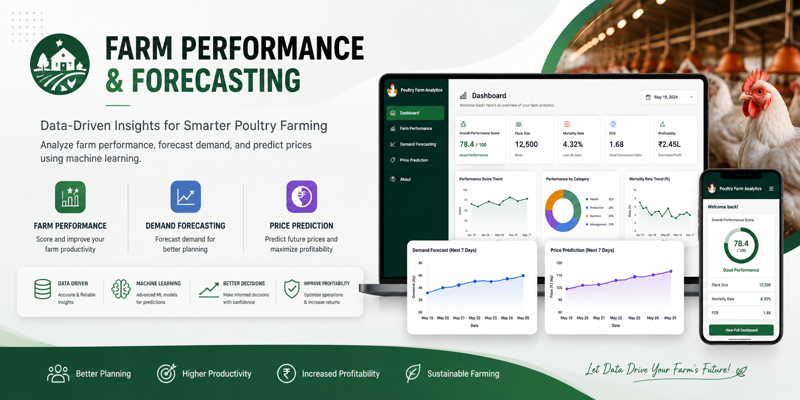

<p align="center">
  
</p>

<h1 align="center">Farm Performance & Forecasting</h1>

<p align="center">
  An end-to-end Machine Learning and Flask-based application for farm performance scoring, demand forecasting, and price prediction.
</p>

<p align="center">


</p>

---

## 📖 Project Overview

**Farm Performance & Forecasting** is an end-to-end Machine Learning application developed to analyze farm performance and provide predictive insights through an interactive Flask web application.

The project combines:

- Data preprocessing
- Exploratory Data Analysis
- Feature engineering
- Farm performance scoring
- Demand forecasting
- Price prediction
- Machine Learning model integration
- Flask web application development

The trained models are integrated into a Flask application, allowing users to access the analytical and prediction components through a web interface.

---

## 🎯 Objectives

The main objectives of this project are:

- Analyze farm-related data and identify meaningful patterns.
- Evaluate farm performance using relevant operational parameters.
- Generate farm performance scores.
- Forecast future demand.
- Predict future prices.
- Integrate trained Machine Learning models into a web application.
- Present analytical and predictive results through a simple and user-friendly interface.

---

# 🧠 Machine Learning Modules

The application consists of three major Machine Learning components.

---

## 1. 🐔 Farm Performance Scoring

The Farm Performance module evaluates farm-related operational information and generates a performance score.

The module provides a summarized view of farm performance and helps identify areas that may require attention.

### Key Areas

- Farm-level performance
- Operational indicators
- Performance scoring
- Performance categorization

### Output

The application provides a farm performance result based on the supplied farm information.

---

## 2. 📈 Demand Forecasting

The Demand Forecasting module uses historical data to generate future demand forecasts.

### Forecast Output

The forecasting component provides future demand estimates that can be used for planning and decision-making.

### Potential Applications

- Production planning
- Resource planning
- Inventory planning
- Demand management

---

## 3. 💰 Price Prediction

The Price Prediction module generates predicted future prices using the trained Machine Learning model.

### Prediction Output

The application provides predicted price information for the selected input conditions.

### Potential Applications

- Price planning
- Revenue planning
- Market analysis
- Business decision-making

---

# 🔄 Project Workflow

The project follows a complete Machine Learning workflow:

```text
Raw Data
   │
   ▼
Data Preprocessing
   │
   ▼
Exploratory Data Analysis
   │
   ▼
Feature Engineering
   │
   ├──────────────────────┐
   ▼                      ▼
Farm Performance      Forecasting &
Scoring               Price Prediction
   │                      │
   └──────────┬───────────┘
              ▼
       Trained ML Models
              │
              ▼
       Flask Application
              │
              ▼
       Interactive Results
```

---

# 📓 Notebook Workflow

The project contains six organized notebooks representing the main stages of the Machine Learning workflow.

### `01_data_preprocessing.ipynb`

Performs the initial preparation and preprocessing of the available data.

### `02_EDA.ipynb`

Performs Exploratory Data Analysis to understand the dataset, distributions, patterns, and relationships.

### `03_feature_engineering.ipynb`

Creates and prepares the features required for the Machine Learning components.

### `04_farm_performance_scoring.ipynb`

Develops the farm performance scoring component.

### `05_demand_forecasting.ipynb`

Develops the demand forecasting component.

### `06_price_prediction.ipynb`

Develops the price prediction component.

---

# 🌐 Flask Web Application

The Machine Learning components are integrated into a Flask-based web application.

The application provides a web interface for accessing the project functionality without requiring users to directly interact with the notebooks.

### Application Flow

```text
Home Page
    │
    ▼
Dashboard
    │
    ├── Farm Performance
    │
    ├── Demand Forecasting
    │
    └── Price Prediction
```

---

# 🖥️ Application Interface

The frontend is built using:

- HTML
- CSS
- JavaScript
- Flask

The application includes:

```text
templates/
├── home.html
└── dashboard.html
```

Static resources are organized as:

```text
static/
├── images/
│   └── hero-farm.png
├── dashboard.css
├── script.js
└── style.css
```

---

# 🛠️ Technology Stack

| Category | Technology |
|---|---|
| Programming Language | Python |
| Web Framework | Flask |
| Machine Learning | Python Machine Learning Libraries |
| Data Processing | Pandas |
| Numerical Computing | NumPy |
| Data Analysis | Jupyter Notebook |
| Frontend | HTML, CSS, JavaScript |
| Model Serialization | Pickle |
| Development Environment | VS Code / Jupyter Notebook |

---

# 📂 Project Structure

```text
Farm-Performance-and-Forecasting
│
├── assets/
│   └── project-banner.png
│
├── data/
│   ├── processed/
│   └── raw/
│
├── models/
│   ├── demand_feature_columns.pkl
│   ├── demand_forecast.pkl
│   ├── farm_feature_columns.pkl
│   ├── farm_performance.pkl
│   ├── forecast_seed.pkl
│   ├── label_encoder.pkl
│   ├── price_feature_columns.pkl
│   └── price_prediction.pkl
│
├── notebooks/
│   ├── 01_data_preprocessing.ipynb
│   ├── 02_EDA.ipynb
│   ├── 03_feature_engineering.ipynb
│   ├── 04_farm_performance_scoring.ipynb
│   ├── 05_demand_forecasting.ipynb
│   └── 06_price_prediction.ipynb
│
├── static/
│   ├── images/
│   │   └── hero-farm.png
│   ├── dashboard.css
│   ├── script.js
│   └── style.css
│
├── templates/
│   ├── dashboard.html
│   └── home.html
│
├── app.py
├── predictor.py
├── requirements.txt
├── README.md
├── LICENSE
└── .gitignore
```

---

# 📊 Model Files

The project contains serialized model and supporting files used by the application:

```text
models/
├── demand_feature_columns.pkl
├── demand_forecast.pkl
├── farm_feature_columns.pkl
├── farm_performance.pkl
├── forecast_seed.pkl
├── label_encoder.pkl
├── price_feature_columns.pkl
└── price_prediction.pkl
```

These files support the Machine Learning components integrated into the Flask application.

---

## ⚠️ Large Model File

The following model file exceeds GitHub's standard individual file-size limit:

```text
models/price_prediction.pkl
```

Therefore, this file is excluded from Git tracking using `.gitignore`.

The local copy can remain in the project folder for local application use.

The corresponding model-development workflow is available in:

```text
notebooks/06_price_prediction.ipynb
```

This keeps the repository within GitHub's file-size limitations while retaining the complete model-development workflow.

---

# 🚀 Installation & Setup

## 1. Clone the Repository

```bash
git clone https://github.com/pranalisundre-gif/FARM-PERFORMANCE-FORECASTING.git
```

## 2. Navigate to the Project

```bash
cd FARM-PERFORMANCE-FORECASTING
```

## 3. Create a Virtual Environment

### Windows

```bash
python -m venv venv
```

Activate the environment:

```bash
venv\Scripts\activate
```

### macOS / Linux

```bash
python3 -m venv venv
```

Activate the environment:

```bash
source venv/bin/activate
```

---

## 4. Install Dependencies

The project includes a `requirements.txt` file.

Run:

```bash
pip install -r requirements.txt
```

---

## 5. Run the Flask Application

```bash
python app.py
```

---

## 6. Open the Application

After starting the Flask server, open:

```text
http://127.0.0.1:5000
```

in your browser.

---

# 📸 Application Preview

## Home Page

The application includes a dedicated home page introducing the farm analytics and forecasting system.

---

## Dashboard

The dashboard provides a centralized interface for accessing farm performance analysis and predictive capabilities.

---

## Farm Performance

The Farm Performance module evaluates the supplied farm information and generates a performance result.

---

## Demand Forecasting

The Demand Forecasting module generates future demand estimates based on the available historical information.

---

## Price Prediction

The Price Prediction module generates future price estimates using the trained prediction model.

---

# 💡 Business Use Cases

The system demonstrates how Machine Learning can support farm management and planning.

### Farm Performance Monitoring

Performance scoring can help identify farms or operational areas that may require attention.

### Demand Planning

Demand forecasting can support future production and resource planning.

### Price Planning

Price prediction can support future pricing and revenue-related decisions.

### Data-Driven Decision Making

Combining historical data, Machine Learning predictions, and interactive analytics provides a broader decision-support workflow.

---

# 🔮 Future Enhancements

Potential future improvements include:

- Automated model retraining.
- Real-time farm data integration.
- Live market price data.
- Advanced forecasting techniques.
- Additional farm performance indicators.
- Model explainability.
- Automated data pipelines.
- Cloud deployment.
- Scheduled prediction updates.
- User authentication and role-based access.
- Mobile-responsive improvements.

---

# 🎓 Skills Demonstrated

This project demonstrates practical experience in:

- Python
- Machine Learning
- Data Preprocessing
- Exploratory Data Analysis
- Feature Engineering
- Predictive Analytics
- Forecasting
- Flask
- Model Integration
- Data Visualization
- Jupyter Notebook
- Web Application Development
- End-to-End Machine Learning Workflow

---

# 👩‍💻 Author

**Pranali Undre**

Information Technology Student

### Areas of Interest

- Data Science
- Machine Learning
- Data Analytics
- Artificial Intelligence
- Business Intelligence

### GitHub

https://github.com/pranalisundre-gif

### LinkedIn

_Add your LinkedIn profile URL here._

---

# ⭐ Support

If you find this project useful or interesting, consider giving the repository a ⭐ on GitHub.

---

# 📜 License

This project is licensed under the **MIT License**.
